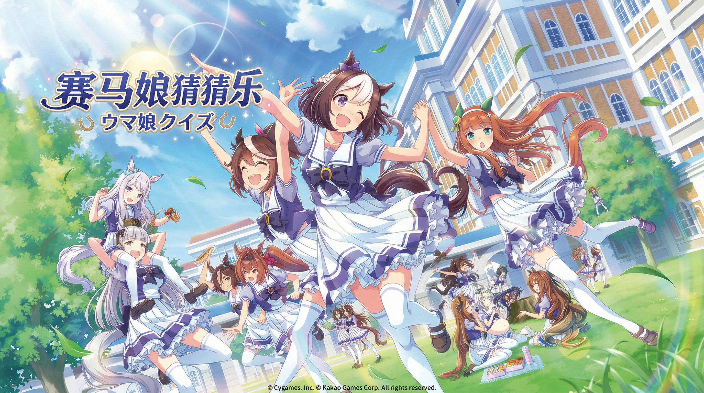
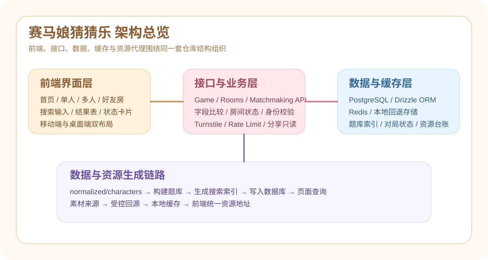
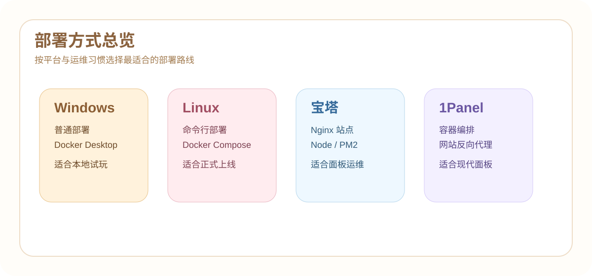

<div align="center">
  
  <h1>赛马娘猜猜乐</h1>
   <h3>UmaGuessingGame</h3>
  <p>面向中文玩家与开源社区的赛马娘猜谜网页游戏，支持单人游玩，并为多人匹配、好友对战和观战同步预留完整扩展结构。</p>
</div>


<div align="center">
  <a href="https://github.com/numakkiyu/UmaGuessingGame/actions/workflows/ci.yml">
    
  </a>
  <a href="https://github.com/numakkiyu/UmaGuessingGame/blob/main/LICENSE">
    
  </a>
  <a href="https://github.com/numakkiyu/UmaGuessingGame/issues">
    
  </a>
  <a href="https://github.com/numakkiyu/UmaGuessingGame/pulls">
    
  </a>
</div>

<div align="center">
  
</div>

<p align="center">
  
</p>

赛马娘猜猜乐是一个围绕赛马娘角色资料设计的网页猜谜项目。玩家通过头像、名字和每次猜测返回的字段提示，逐步逼近目标角色；维护者则可以通过仓库内已经整理好的数据文件、题库构建脚本、部署脚本和 GitHub 协作模板，直接把项目部署到本地、服务器或面板环境。

## 你能在这里得到什么

<table>
  <tr>
    <td width="33%">
      <h3>完整游戏实现</h3>
      <p>包含单人对局、题库构建、图片代理缓存、房间编码、分享只读链路，以及多人 / 好友对战的结构预留。</p>
    </td>
    <td width="33%">
      <h3>成熟部署链路</h3>
      <p>提供 Docker Compose、一键脚本、普通命令行部署说明，以及宝塔面板、1Panel 的详细部署步骤。</p>
    </td>
    <td width="33%">
      <h3>标准化协作配置</h3>
      <p>仓库内已经带有 GitHub Actions、Dependabot、Issue 模板、PR 模板、贡献指南与安全策略。</p>
    </td>
  </tr>
</table>

## 架构总览

<p align="center">
  
</p>


### 核心架构说明

- 前端采用 `Next.js + React + TypeScript`，负责页面渲染、输入交互、对局展示与房间入口。
- 后端接口同样运行在 Next.js App Router 的 Route Handlers 中，负责创建对局、提交猜测、房间同步、资源代理和安全校验。
- 数据层使用 `PostgreSQL + Drizzle ORM`，存储正式题库索引、游戏状态、猜测记录与资源记录。
- 缓存与限流层使用 `Redis`，承担频率限制、房间同步辅助与高频请求保护。
- 图片策略采用“受控回源 + 本地缓存复用”，正式展示优先使用项目自己的资源路径，不直接高并发热链第三方源站。
- 题库构建、搜索索引和手工修订统一由仓库内脚本生成，正式运行只依赖仓库内数据目录。

更详细的模块说明见 [技术架构说明](./docs/技术架构说明.md)。

## 支持的部署方式

<p align="center">
  
</p>

| 平台 | 适合场景 | 推荐方式 | 详细文档 |
| --- | --- | --- | --- |
| Windows | 本地测试、演示、局域网试玩 | Docker Desktop 或本机 Node.js 运行 | [Windows 部署指南](./docs/Windows部署指南.md) |
| Linux | 公网正式部署、长期运行 | Docker Compose / PM2 + Nginx | [Linux 部署指南](./docs/Linux部署指南.md) |
| 宝塔面板 | 面板化运维 | 宝塔 + Nginx 反向代理 + Node/PM2 | [Linux 部署指南](./docs/Linux部署指南.md) |
| 1Panel | 容器化面板运维 | 1Panel 编排 / 网站反向代理 | [Linux 部署指南](./docs/Linux部署指南.md) |
| macOS | 本机开发、演示、设计联调 | Homebrew 或 Docker Desktop | [macOS 部署指南](./docs/macOS部署指南.md) |

## 快速开始

### Docker 方式

```bash
git clone https://github.com/numakkiyu/UmaGuessingGame.git
cd UmaGuessingGame
cp .env.example .env
docker compose -f docker-compose.dev.yml up -d --build
```

### 本机 Node.js 方式

```bash
git clone https://github.com/numakkiyu/UmaGuessingGame.git
cd UmaGuessingGame
cp .env.example .env
npm install
npm run prepare:data
npm run db:push
npm run db:seed
npm run dev
```

> `.env.example` 已带中文注释，正式上线前请务必替换域名、数据库、Redis 与 Turnstile 的真实配置。

## 文档目录

| 文档 | 作用 |
| --- | --- |
| [快速开始](./docs/快速开始.md) | 最快拉起本项目的入口说明 |
| [Windows部署指南](./docs/Windows部署指南.md) | Windows 的普通部署与 Docker 部署 |
| [Linux部署指南](./docs/Linux部署指南.md) | Linux 命令行、Docker、宝塔、1Panel 的详细部署 |
| [macOS部署指南](./docs/macOS部署指南.md) | macOS 的普通部署与 Docker 部署 |
| [技术架构说明](./docs/技术架构说明.md) | 项目模块、数据流、部署结构和安全边界 |
| [维护与更新指南](./docs/维护与更新指南.md) | 数据、文档、依赖、CI 和版本维护建议 |
| [文档索引](./docs/文档索引.md) | 当前公开文档的用途与更新时机 |
| [第三方依赖与资料来源](./docs/第三方依赖与资料来源.md) | 开源依赖、资料来源、版权与致谢说明 |

## 目录结构

```text
UmaGuessingGame/
├─ .github/                      # CI、Issue 模板、PR 模板、Dependabot
├─ data/                         # 标准化角色数据、题库产物、素材清单、手工补充数据
├─ docs/                         # 面向 GitHub 的公开项目文档
├─ public/                       # 静态资源、UI 图片、角色头像缓存
├─ scripts/                      # 构建、清洗、部署和一键启动脚本
├─ src/                          # 应用源码
├─ tests/                        # 自动化测试
├─ .env.example                  # 中文注释环境变量模板
├─ docker-compose.yml            # 生产 Docker 编排
├─ docker-compose.dev.yml        # 开发 Docker 编排
├─ Dockerfile                    # 生产镜像构建
├─ CONTRIBUTING.md               # 贡献指南
├─ CODE_OF_CONDUCT.md            # 行为准则
├─ SECURITY.md                   # 安全策略
└─ README.md                     # 项目首页
```

## 运维与维护建议

- 玩法字段、题库准入规则、部署方式发生变化时，请同步更新文档。
- 新增接口或安全策略时，请同步补测试与配置说明。
- 图片和资料来源变更时，请同步维护素材台账。
- 对外部署时，优先使用 PostgreSQL 与 Redis 的正式服务，不要长期依赖开发回退模式。

详细维护建议见 [维护与更新指南](./docs/维护与更新指南.md)。

## 贡献

仓库已经内置以下贡献能力：

- `Bug report`、`Feature request`、`Documentation improvement` 三类 Issue 模板
- Pull Request 模板
- CI 自动校验工作流
- Dependabot 周期更新
- `CONTRIBUTING.md`、`CODE_OF_CONDUCT.md`、`SECURITY.md`

如果你准备参与开发，请先阅读 [CONTRIBUTING](./CONTRIBUTING.md)。

## 资料来源与致谢

- 赛马娘官方网站
- 哔哩哔哩游戏百科 BWIKI
- 萌娘百科

本项目由 [北海的佰川](https://github.com/numakkiyu) 开发与维护。

角色图片版权归属于 Cygames，感谢各资料站维护者为社区提供的整理与校对工作。

## License

本项目采用 [MIT License](./LICENSE) 开源，任何人都可以在遵守许可协议的前提下继续修改、分发和发布。

